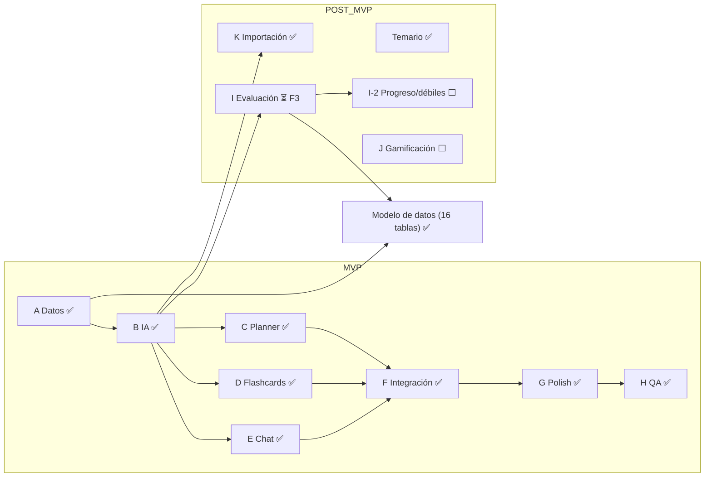

# FID — Snapshot de handoff (Bract)
> Generado durante el Agente I (Evaluación), pausado antes de F3 · Retomar en: repo Bract (darkhyper93-jpg/Bract)

## Mapa del proyecto

## Estado actual

**Hecho y deployado (Render API + web, Supabase, Upstash, Gemini free tier):** MVP completo (A datos, B lib/ai, C planner, D flashcards+SRS, E chat+streaming, F integración cruzada, G polish, H QA) + post-MVP K (importación de temas por texto Y archivos pdf/txt/md/pptx) + sección Temario + polish del tono del chat. Todo en main, andando en producción.

**En progreso — Agente I (Evaluación / quiz):** branch `agente-i-quiz`, NO mergeada. Completado y verificado:
- F0 README spec-first (§3.5 modelos+enum+reglas, §5.5 rutas, §8.8 feature, Fase 14 con I-2 fuera de alcance).
- F1 `@bract/shared`: `types/quiz.types.ts` + `schemas/quiz.schema.ts` (QuizScope, GeneratedQuiz, QuizAttempt(WithItems), generateQuizSchema con superRefine, createQuizAttemptSchema, MAX_QUIZ_QUESTIONS=10). Typecheck verde en los 3 paquetes.
- F2 Prisma: modelos `QuizAttempt` + `QuizAttemptItem` + enum `QuizScope`, back-relations en User/Subject/Topic, FK SetNull. **`db push` YA corrido y verificado** contra Supabase: tablas `quiz_attempts` y `quiz_attempt_items` creadas (0 filas), ninguna tabla existente tocada.

**Próximo paso exacto:** F3 — `lib/ai` función `generateQuiz` (aditiva, sin romper contrato actual), responseSchema de Gemini SIN additionalProperties, validación Zod del output, prompt `QUIZ_SYSTEM`, explicaciones por opción generadas en la MISMA llamada (NO 2da llamada de IA en la corrección), mock tests. Luego F4 (backend modules/quiz: repo/service/controller/routes + vitest), F5 (frontend features/quiz: Setup→Runner→Resultados→Historial, 4 estados, i18n, ruta /quiz, sidebar label "Evaluación"/"Quiz"), F6 (verificación typecheck/lint/test + diff).

**Decisiones del Agente I (confirmadas):** QuizAttemptItem persiste topicId + isCorrect + userId denormalizado con índices [userId,topicId] y [userId,topicId,isCorrect] (base para I-2 puntos débiles). Generación efímera (el quiz NO se persiste, solo el intento final). Corrección local en el front + recomputo en backend al guardar el intento. Incluye los 2 GET (historial + detalle) en este pase. I-2 (dashboard de progreso + puntos débiles) queda fuera de alcance, para después.

**Workflow del orquestador (Claude en chat = decide; usuario = ojos y manos):** revisión plan-first por fase, el agente NO mergea, muestra diff por fase, commit antes de mergear, ff-only a main al final. Verificación antes/durante/después. db push lo corre el usuario (Session pooler 5432) cuando hay modelos nuevos.

**Bloqueantes:** ninguno. Pendiente seguridad: resetear la password de Supabase (pasó por el chat) y actualizar DATABASE_URL en Render cuando convenga.

**Decisiones técnicas clave (detalle en error.md):** Session pooler 5432 no 6543 (6543 no soporta DDL); enums Prisma↔shared casteados en el service; merge directo a main (no PR, lint del PR roto); `db push` manual (no migrations); exports condicionales en @bract/shared (node→dist, bundler→src); IA = Gemini free tier vía @google/genai (NO @google/generative-ai, EOL nov-2025), modelos gemini-2.5-flash-lite (gen) y gemini-2.5-flash (chat); chat sin # ni *, bullets con `·`.

**Docs autoritativos:** `PLAN_AGENTES.md`, `error.md`, `IDEAS_POST_MVP.md` (I, I-2, J gamificación con codex.io de referencia, Temario), `MENSAJES_AGENTES.md`, `git log`.

---
> Para retomar: pegá este archivo al inicio de un chat nuevo. Verificá el estado real contra `git log` y los docs antes de actuar. El próximo mensaje al agente es el kickoff de F3 (lib/ai → generateQuiz).
