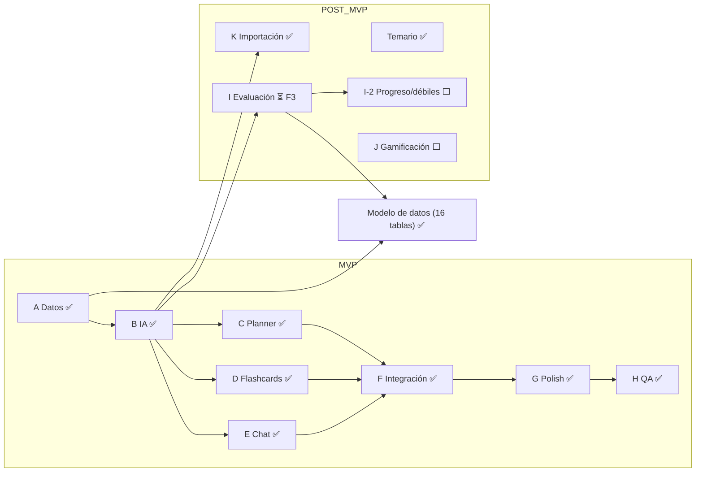

# FID — Snapshot de handoff (Bract)
> Agente I (quiz) + I-2 (progreso/personalización) COMPLETOS y deployados · Próximo: L Voz (Web Speech API) · Retomar en: repo Bract (darkhyper93-jpg/Bract)

## ESTADO REAL (jun 2026) — leer esto primero, lo de abajo quedó viejo

Bract está deployado y funcional: MVP completo (A–H) + post-MVP K (importación texto/archivos) + Temario + **Agente I (Evaluación/quiz) COMPLETO** + **I-2 (Progreso, puntos débiles y personalización) COMPLETO**. Todo en main, en producción (Render + Supabase + Upstash + Gemini free tier). Último merge I-2: `ff1d061`.

**I-2 — cómo quedó (mergeado a main):** sección nueva "Progreso" (/progress) con dashboard (% acierto por tema/materia + puntos débiles), motor read-only on-the-fly (`progress.formula.ts` puro + `progress.repository.ts` groupBy ~5 queries constantes sin N+1 + `progress.service.ts` getOverview/getWeakTopics/getWeaknessMap), preferencias (`UserStudyPreferences`: enum RemediationIntensity OFF/LOW/MEDIUM/HIGH default LOW, α 0/0.33/0.66/1.0, prioritySubjectIds[], pesos). weakness 100% objetiva (quiz+SRS); PRIORIDAD es término SEPARADO e independiente de α (nudge fijo P=3 días). Planner (capa 2) y chat (capa 3) aditivos detrás de try/catch → sin datos/OFF/error = byte-idéntico a hoy; golden tests. db push de `user_study_preferences` ya aplicado y verificado. Endpoints /api/v1 [self]: GET /progress/overview, GET /progress/weak-topics, GET/PUT /preferences.

**PRÓXIMO — L Voz (Web Speech API del navegador, gratis):** dictado en el chat (SpeechRecognition) + lectura de respuestas del tutor (SpeechSynthesis). Degradar elegante si el navegador no soporta. NO Whisper/ElevenLabs (cuestan). Mayormente frontend. Spec-first como siempre. Detalle en IDEAS_POST_MVP.md.
- Roadmap restante tras L: J Gamificación (misiones adaptadas a metas/horarios; refs codex.io [principal/diseño], Arise [fitness], coddy.tech) → pase estético premium (último, transversal; ref codex.io).

**Mejora futura anotada (no urgente):** /progress llama overview + weak-topics → 2× computeAll (~10 queries por carga). Aceptable v1; si pesa, cache por request.

**Agente I — diseño que shippeó (NO el "efímero" original; se revirtió por anti-trampa real):** corrección POR PREGUNTA server-side. Modelo `QuizAttempt` (status IN_PROGRESS/COMPLETED, completedAt, scope, subjectId?, topicId?, scopeName, totalCount, correctCount) + `QuizAttemptItem` (question, options Json [{text,explanation}] autoritativo, correctIndex, selectedIndex Int? nullable, isCorrect, topicId?, userId, order; índices [userId,topicId] y [userId,topicId,isCorrect] para I-2). Endpoints /api/v1 [self]: POST /quiz/attempts (genera: ownership → IA primero, 503 sin persistir si falla → crea intento IN_PROGRESS con respuestas server-side → devuelve preguntas PÚBLICAS sin correctIndex), POST /quiz/attempts/:id/answers (responde 1: lock si ya respondida → grading vs lo guardado → reveal de esa pregunta), GET /quiz/attempts (historial COMPLETED), GET /quiz/attempts/:id (detalle con gating: items contestados completos, no contestados públicos — anti-espiar al reanudar). Frontend features/quiz/: Setup (RHF+Zod) → Runner pregunta-por-pregunta con reveal del server, hidrata desde el detalle al remontarse (attemptId en QuizPage + localStorage) → Resultados → Historial.

**Fix de reanudación + seguridad (branch agente-i-quiz-fix):** cerró el hueco (el detalle filtraba correctIndex de preguntas no contestadas en intentos IN_PROGRESS → se podían espiar) y el bug UX (ir a Historial y volver perdía el progreso → "ya fue respondida"). Solución: server = fuente de verdad al reanudar (`toDetailItem` gatea el reveal por estado) + Runner attemptId-driven que hidrata del detalle. 72/72 tests. db push NO requerido (no cambió el modelo).

**Próximo en el roadmap (en orden):** I-2 (dashboard progreso + puntos débiles; datos ya listos) → L Voz (Web Speech API gratis: dictado en chat + lectura; degradar elegante; NO Whisper/ElevenLabs) → J Gamificación (misiones adaptadas a metas/horarios; refs codex.io [principal, diseño], Arise [fitness], coddy.tech) → Pase estético premium (último, transversal; ref codex.io). Detalle en IDEAS_POST_MVP.md.

**Workflow orquestador:** Claude en chat decide todo; usuario = ojos y manos (relaya output del agente, pega mis respuestas). Plan-first por fase, agente NO mergea, diff por fase, commit antes de merge, ff-only a main (dispara deploy). Claude lee él mismo los archivos críticos y verifica la DB vía MCP de Supabase. db push lo corre el usuario (Session pooler 5432) cuando hay modelos nuevos: en CMD `set DATABASE_URL=...` sin comillas + `npx prisma db push`; en PowerShell `$env:DATABASE_URL="..."` + `npx.cmd prisma db push`.

**Pendiente seguridad (no urgente):** resetear password de Supabase (pasó por el chat) + actualizar DATABASE_URL en Render.

---
## (Histórico — quedó desactualizado, ignorar el bloque de abajo)

## Mapa del proyecto

## Estado actual

**Hecho y deployado (Render API + web, Supabase, Upstash, Gemini free tier):** MVP completo (A datos, B lib/ai, C planner, D flashcards+SRS, E chat+streaming, F integración cruzada, G polish, H QA) + post-MVP K (importación de temas por texto Y archivos pdf/txt/md/pptx) + sección Temario + polish del tono del chat. Todo en main, andando en producción.

**En progreso — Agente I (Evaluación / quiz):** branch `agente-i-quiz`, NO mergeada. Completado y verificado:
- F0 README spec-first (§3.5 modelos+enum+reglas, §5.5 rutas, §8.8 feature, Fase 14 con I-2 fuera de alcance).
- F1 `@bract/shared`: `types/quiz.types.ts` + `schemas/quiz.schema.ts` (QuizScope, GeneratedQuiz, QuizAttempt(WithItems), generateQuizSchema con superRefine, createQuizAttemptSchema, MAX_QUIZ_QUESTIONS=10). Typecheck verde en los 3 paquetes.
- F2 Prisma: modelos `QuizAttempt` + `QuizAttemptItem` + enum `QuizScope`, back-relations en User/Subject/Topic, FK SetNull. **`db push` YA corrido y verificado** contra Supabase: tablas `quiz_attempts` y `quiz_attempt_items` creadas (0 filas), ninguna tabla existente tocada.

**Próximo paso exacto:** F3 — `lib/ai` función `generateQuiz` (aditiva, sin romper contrato actual), responseSchema de Gemini SIN additionalProperties, validación Zod del output, prompt `QUIZ_SYSTEM`, explicaciones por opción generadas en la MISMA llamada (NO 2da llamada de IA en la corrección), mock tests. Luego F4 (backend modules/quiz: repo/service/controller/routes + vitest), F5 (frontend features/quiz: Setup→Runner→Resultados→Historial, 4 estados, i18n, ruta /quiz, sidebar label "Evaluación"/"Quiz"), F6 (verificación typecheck/lint/test + diff).

**Decisiones del Agente I (confirmadas):** QuizAttemptItem persiste topicId + isCorrect + userId denormalizado con índices [userId,topicId] y [userId,topicId,isCorrect] (base para I-2 puntos débiles). Generación efímera (el quiz NO se persiste, solo el intento final). Corrección local en el front + recomputo en backend al guardar el intento. Incluye los 2 GET (historial + detalle) en este pase. I-2 (dashboard de progreso + puntos débiles) queda fuera de alcance, para después.

**Workflow del orquestador (Claude en chat = decide; usuario = ojos y manos):** revisión plan-first por fase, el agente NO mergea, muestra diff por fase, commit antes de mergear, ff-only a main al final. Verificación antes/durante/después. db push lo corre el usuario (Session pooler 5432) cuando hay modelos nuevos.

**Bloqueantes:** ninguno. Pendiente seguridad: resetear la password de Supabase (pasó por el chat) y actualizar DATABASE_URL en Render cuando convenga.

**Decisiones técnicas clave (detalle en error.md):** Session pooler 5432 no 6543 (6543 no soporta DDL); enums Prisma↔shared casteados en el service; merge directo a main (no PR, lint del PR roto); `db push` manual (no migrations); exports condicionales en @bract/shared (node→dist, bundler→src); IA = Gemini free tier vía @google/genai (NO @google/generative-ai, EOL nov-2025), modelos gemini-2.5-flash-lite (gen) y gemini-2.5-flash (chat); chat sin # ni *, bullets con `·`.

**Docs autoritativos:** `PLAN_AGENTES.md`, `error.md`, `IDEAS_POST_MVP.md` (I, I-2, J gamificación con codex.io de referencia, Temario), `MENSAJES_AGENTES.md`, `git log`.

---
> Para retomar: pegá este archivo al inicio de un chat nuevo. Verificá el estado real contra `git log` y los docs antes de actuar. El próximo mensaje al agente es el kickoff de F3 (lib/ai → generateQuiz).
