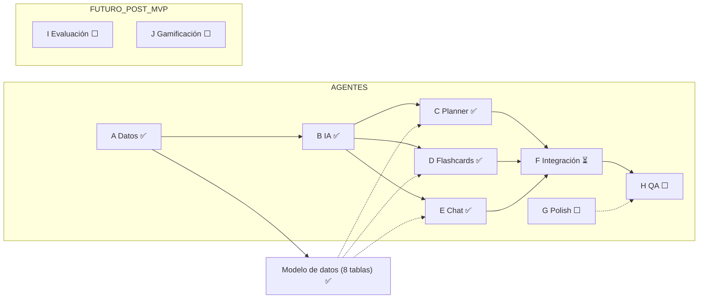

# FID — Snapshot de handoff (Bract)
> Generado tras cerrar el Agente E · Retomar en: repo Bract (darkhyper93-jpg/Bract)

## Mapa del proyecto

## Estado actual

**Hecho:** A (datos+tipos/Zod), B (capa lib/ai), C (planner), D (flashcards+SRS), E (chat+streaming) — todos mergeados a main y deployados en Render (API + web). MVP de las 3 secciones casi completo.
**En progreso:** F — contexto compartido / invalidaciones cruzadas entre planner, flashcards y chat (el diferencial). Terreno listo: el chat ya reusa `plannerService.listSubjects` como fuente única del árbol.
**Próximo:** F → G (polish: eslint nunca instalado, i18n incompleto, toggle idioma, "Invalid Date" perfil, lista notificaciones, Textarea ya hecho) → H (QA end-to-end + deploy).
**Bloqueantes:** ninguno. Pendiente cargar `AI_API_KEY` (Anthropic) en .env local + Render — sin ella, chat y generación degradan a AI_UNAVAILABLE 503; el resto anda.
**Decisiones clave (punteros, detalle en error.md):** Session pooler 5432 no 6543; enums Prisma↔shared se castean en el service; merge directo a main (no PR, lint roto); deploy Render con `db push` manual; exports condicionales en @bract/shared (node→dist, bundler→src).
**Docs autoritativos:** `PLAN_AGENTES.md` (plan + 8 agentes), `error.md` (decisiones técnicas), `IDEAS_POST_MVP.md` (Agentes I evaluación + J gamificación — codex.io de referencia), `MENSAJES_AGENTES.md` (kickoffs), `git log` (código real).

---
> Para retomar: pegá este archivo al inicio de un chat nuevo. Este snapshot puede estar algo atrás — verificá el estado real contra `git log` y los docs antes de actuar.
